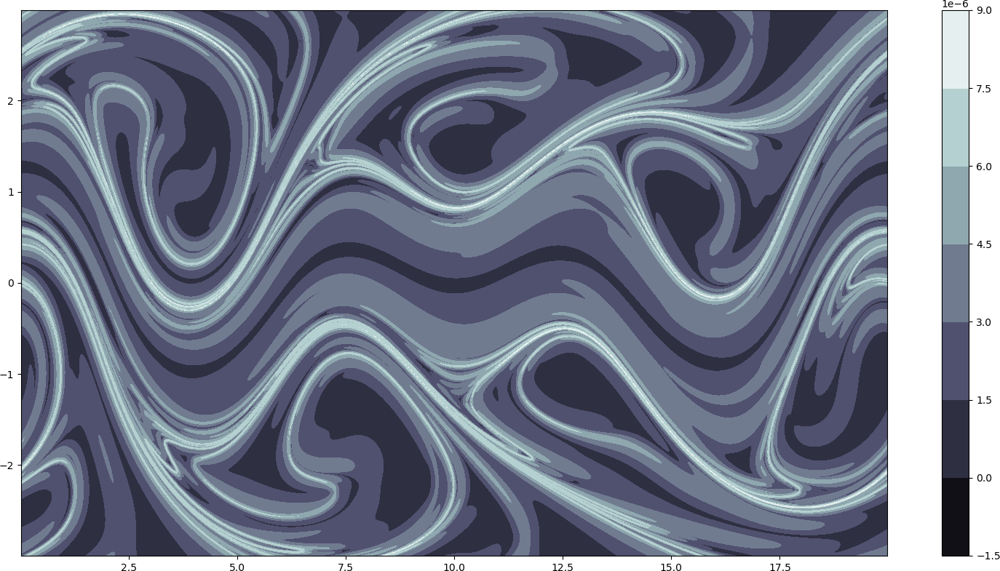

# Lagrangian coherent structures with Finite-Time Lyaponov Exponent (FTLE)

This page has been setup to support the work presented in the poster, **_Lagrangian hairpins in atmospheric boundary layers_**. Please find the poster here: https://doi.org/10.1103/APS.DFD.2021.GFM.P0018.

This version of the code features all functions as described in the poster. However, reading 2D and 3D data needs to be made more user-friendly. This will be updated over time. 

As of now, one can play with the parameters of a _Bickley jet, time dependent and independent double gyre and ABC flow data_. The code structure takes a module based approach where one or several modules can be activated. For instance, to run a Bickley jet example, one needs to set the following parameters:

_\_system = 'Bickley'_\
_\_integrationType = 'forward' # or 'backward'_\
_\_computeVelocity = False_\
_\_writeVelocityData = False_\
_\_advectParticles = True_\
_\_computeFTLE = True_

Other parameters such as the start, end time and number of integration steps can be set within _if \_system == 'Bickley':_.\
Further parameters for the Bickley jet can be set in the file Dynamical_systems/Bickley.py for serial and multiprocessing modes. For GPU, navigate to GPU/Bickley_rk4.py.

If you'd like to have a visualization with python's matplotlib, the following needs to be set to True

_\_contourFTLE = True_

Finally, the code can be run with 3 modes: Serial, CPU-parallelized with multiprocessing and GPU-parallelized with numba-cuda. 

For CPU-parallelization, set _\_enableMultiProcessing = True_ and set _\_CPU = 'The number of CPUs you want'_.
For GPU-parallelization, set _\_enableGPU = True_. Block dimensions and grid dimensions can be set within the code if necessary. 
The default mode is serial when both _\_enableMultiProcessing_ and _\_enableGPU_ are False. 

Finally, the code feaures writing the result in either Tecplot ASCII, Amira ASCII or Amira binary formats. Support for RAW3D will be added soon. 

**Please cite the following work if this code is used**

_BibTex_

@article{harikrishnanp0018,\
  title={P0018: Lagrangian hairpins in atmospheric boundary layers},\
  author={Harikrishnan, Abhishek Paraswarar and Ernst, Natalia and Ansorge, Cedrick and Klein, Rupert and Vercauteren, Nikki},\
  publisher={APS}\
}

_APA_

Harikrishnan, A. P., Ernst, N., Ansorge, C., Klein, R., & Vercauteren, N. P0018: Lagrangian hairpins in atmospheric boundary layers.

# Gallery

## Bickley jet

## Time-dependent double gyre

## Time-independent double gyre

## ABC flow

